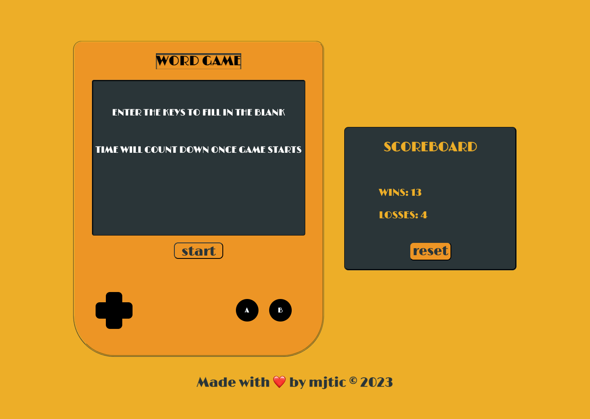
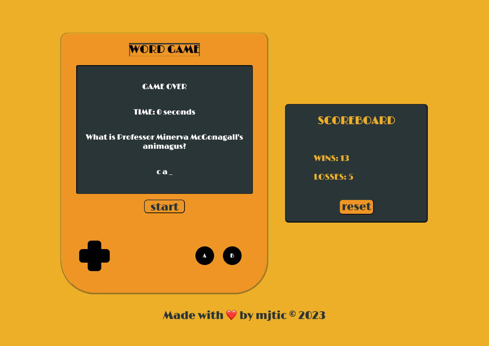
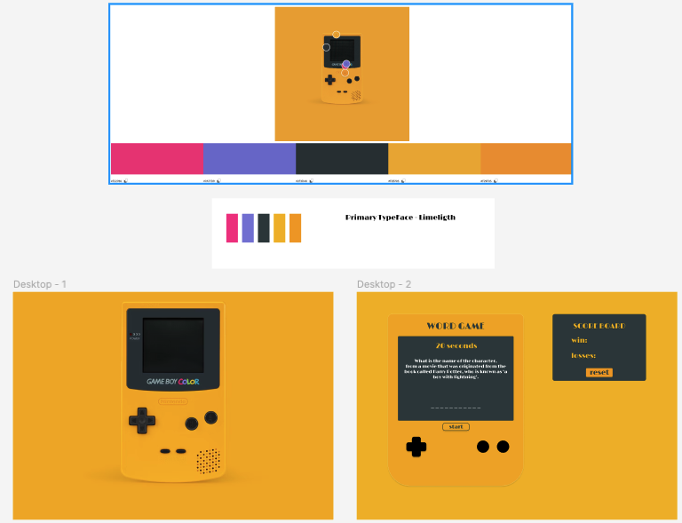

# WORD-GAME

This is a straightforward word game, implemented with JavaScript and Web APIs. It's a mixed trivia timed quiz where each question is allocated a 2-minute timeframe.

## TOOLS

* HTML
* CSS
* JAVASCRIPT

## INSTRUCTION

### Dependencies
All you need is a web brower to play this game
WORD GAME: [https://mjtic.github.io/word-game/]

### Installing

 * Download the zip file or clone the repository to your local machine. [git@github.com:mjtic/word-game.git]

### Author

MJ Jeong - https://github.com/mjtic

### Specifications
Complete Guide to how to play:

* When a user clicks on the "start" button word game will start.

* When a user presses a letter key, the user's guess gets captured as a key event.

* When a user correctly guesses a letter, the corresponding blank "_" is replaced by the letter. For example, if the user correctly selects "a", then "a _ _ a _" will appear. 

* When a user wins or loses a game, a message appear and the timer stops. 

* When a user clicks the start button, the timer resets.

* When a user clicks on "reset" button located on scoreboard, the scores on the board will reset.

## 💡 Version History

* v00
  *  Inital Release
* v01
  *  CSS Update
      - Media Query
      - Added more font-colors
  *  JavaScript Update
      - Made code more modular
  *  Mobile Update
      - Currently only supports iPhones

## License
 
 * This project is licensed under the [MIT] License - see the LICENSE.md file for details

## 🏆 Acknowledgments

Thanks to:

* Mike Meyers for the amazing design idea [https://unsplash.com/@mike_meyers]

Referred to the documentation:

* [MDN Web Docs on KeyboardEvent](https://developer.mozilla.org/en-US/docs/Web/API/KeyboardEvent)

* [MDN Web Docs on Array](https://developer.mozilla.org/en-US/docs/Web/JavaScript/Reference/Global_Objects/Array)

* [MDN Web Docs on loops and iteration](https://developer.mozilla.org/en-US/docs/Web/JavaScript/Guide/Loops_and_iteration)

* [MDN Web Docs on setInterval()](https://developer.mozilla.org/en-US/docs/Web/API/WindowOrWorkerGlobalScope/setInterval)

* [MDN Web Docs on clearInterval()](https://developer.mozilla.org/en-US/docs/Web/API/WindowOrWorkerGlobalScope/clearInterval)

* [MDN Web Docs on localStorage](https://developer.mozilla.org/en-US/docs/Web/API/Window/localStorage)

---

© Made with ❤️️ by mjtic &copy; 2023. 
